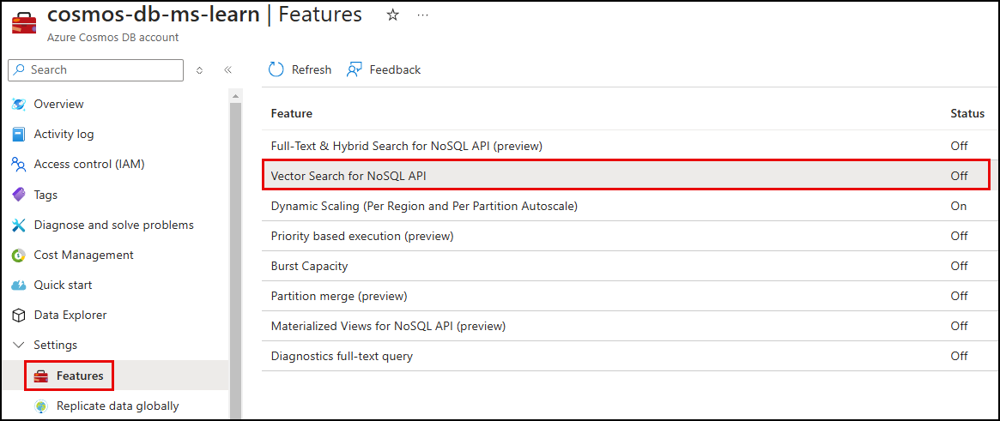
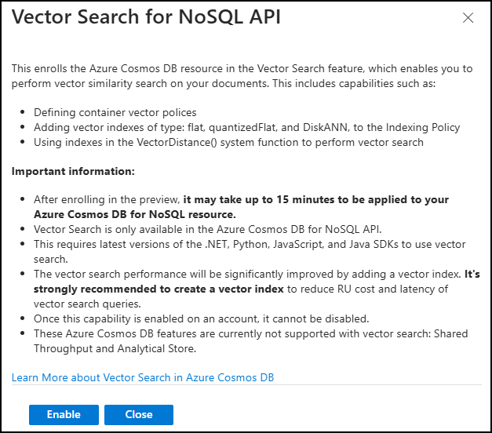

Azure Cosmos DB for NoSQL includes a vector search feature, which provides a robust method for managing and querying high-dimensional vectors. This capability is essential for AI copilots requiring an integrated vector search capability. Azure Cosmos DB for NoSQL's integrated vector database allows embeddings to be stored, indexed, and queried alongside the original data, meaning each document in your database can contain high-dimensional vectors and traditional schema-free data. Keeping the vector embeddings and the original data they represent together facilitates better multi-modal data operations and enables greater data consistency, scale, and performance. It also simplifies data management, AI application architectures, and the efficiency of vector-based operations.

## What is vector search?

Vector search is a technique that allows items to be found based on their data characteristics instead of exact matches on a specific property or field. Instead of requiring exact matches, vector search enables you to identify matches based on their vector representations. This technique is advantageous when performing similarity searches and is particularly valuable in applications that require searching for information within large blocks of text. It plays a critical role in the implementation of the retrieval augmented generation (RAG) pattern frequently used by AI copilots by enabling secure and efficient integration of proprietary data into large language model (LLM) responses, ensuring that AI copilots can provide precise, domain-specific answers while maintaining the confidentiality and integrity of sensitive information.

## Understand embeddings in vector search

Vectors, also known as embeddings or vector embeddings, are mathematical representations of data in a high-dimensional space. Each dimension corresponds to a feature of the data in this space, and tens of thousands of dimensions might be used to represent sophisticated data. A vector's position in this space represents its characteristics. Words, phrases, or entire documents, as well as images, audio, and other types of data, can all be vectorized. Because data is represented as a vector, vector search can identify matching data across different data types.

An embedding is a data representation format that machine learning models and algorithms can efficiently utilize. The embedding is an information-dense representation of the semantic meaning of a piece of text. Each embedding is a vector of floating point numbers. Hence, the distance between two embeddings in the vector space correlates with the semantic similarity between two inputs in the original format.

## Generate embeddings

Azure OpenAI provides several models for creating embeddings, including the `text-embedding-ada-002` and `text-embedding-3-large` models. Embeddings are generated by sending data to an embedding model, where it is transformed into a vector. Those vectors can then be stored as an embedding field within Azure Cosmos DB for NoSQL. Azure Cosmos DB for NoSQL supports the creation of vector search indexes on top of these embedding fields. A vector search index is a container of vectors in latent space that enables a semantic similarity search across all data (vectors) contained within.

## Improve vector search efficiency with vector indexing

A vector index is specialized for high-dimensional vector data. It increases the efficiency of vector searches using the `VectorDistance` system function in Azure Cosmos DB for NoSQL.

Vector searches have reduced latency, higher throughput, and decreased RU consumption when using a vector index. A vector index search allows for a prompt pre-processing step where information can be semantically retrieved from an index and then used to generate a factually accurate prompt for the LLM to reason over. This process provides knowledge augmentation and domain-specific focus to an LLM. The vector search index returns a list of documents whose vector field is semantically similar to the incoming message. The original text stored within the same document augments the LLM's prompt, which the LLM then uses to respond to the requestor based on the information it has been provided.

## Enable Vector Search in Azure Cosmos DB for NoSQL

Enabling the Vector Search for NoSQL API feature in Azure Cosmos DB can be done via the [Azure portal](https://portal.azure.com) or the Azure command-line interface (Azure CLI).

In the Azure portal, it is listed under **Features**.



After reviewing the feature description, you can enable the **Vector Search for NoSQL API** feature.



To enable Vector Search via the Azure CLI, execute the following command from the Azure Cloud Shell:

```azurecli
az cosmosdb update \
 --resource-group <resource-group-name> \
 --name <account-name> \
 --capabilities EnableNoSQLVectorSearch
```

## Define container vector policy

Once enabled on your Azure Cosmos DB for NoSQL account, you can create a new container and define the container vector policy. You can also specify a vector indexing policy there. The following types of vector index policies are supported:

| Type | Description | Max dimensions |
| ---- | ----------- | -------------- |
| flat | Stores vectors on the same index as other indexed properties. | 505 |
| quantizedFlat | Quantizes (compresses) vectors before storing on the index. This can improve latency and throughput at the cost of a small amount of accuracy. | 4096 |
| diskANN | Creates an index based on DiskANN for fast and efficient approximate search. | 4096 |

## Perform vector search with queries using VectorDistance()

After creating a container with a vector policy, and inserting vector data into that container, you can conduct vector searches using the `VectorDistance` system function. An example of a NoSQL query that projects the similarity score as the alias `SimilarityScore`, and sorts in order of most-similar to least-similar:

```sql
SELECT TOP 3 c.name, c.description, VectorDistance(c.embedding, [1,2,3]) AS SimilarityScore   
FROM c  
ORDER BY VectorDistance(c.embedding, [1,2,3])
```

> Important
>
> You should always use a `TOP N` clause in the `SELECT` statement of your queries. Without it, the vector search will attempt to return many more matches, resulting in the query costing more RUs and having higher latency than necessary.
